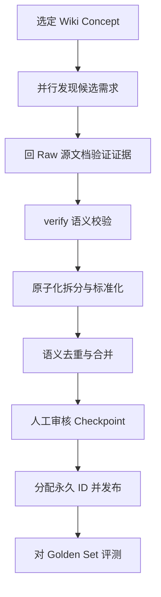
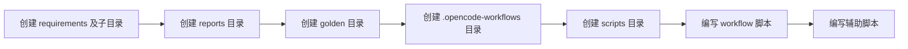
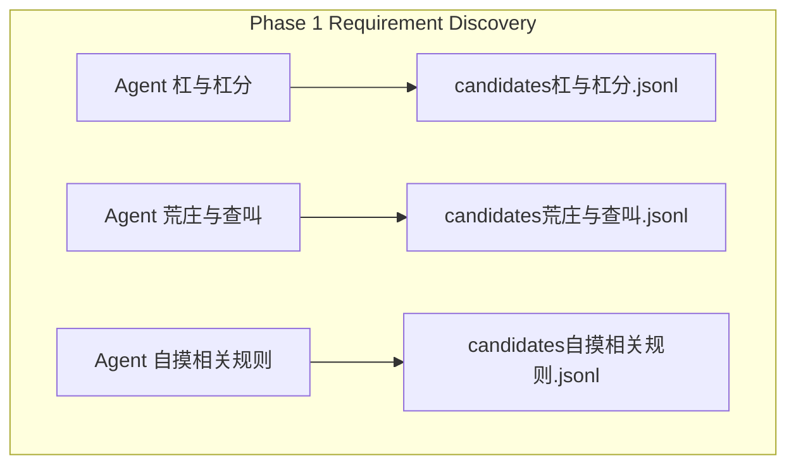
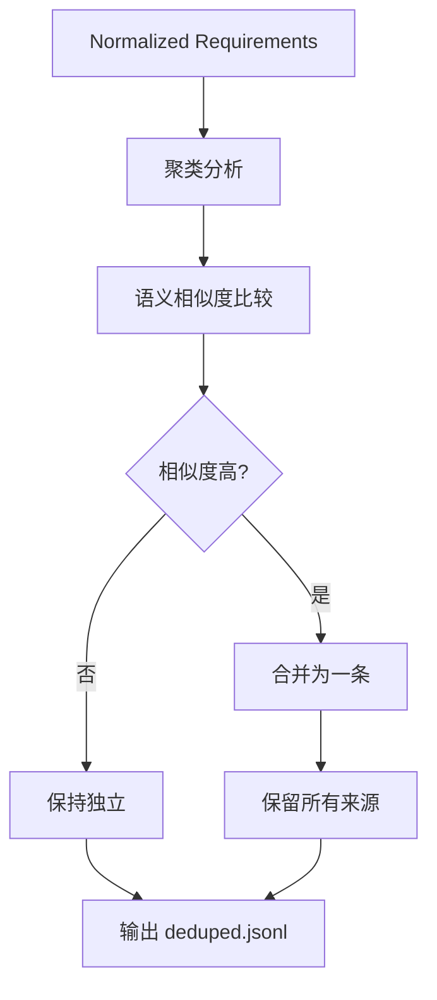
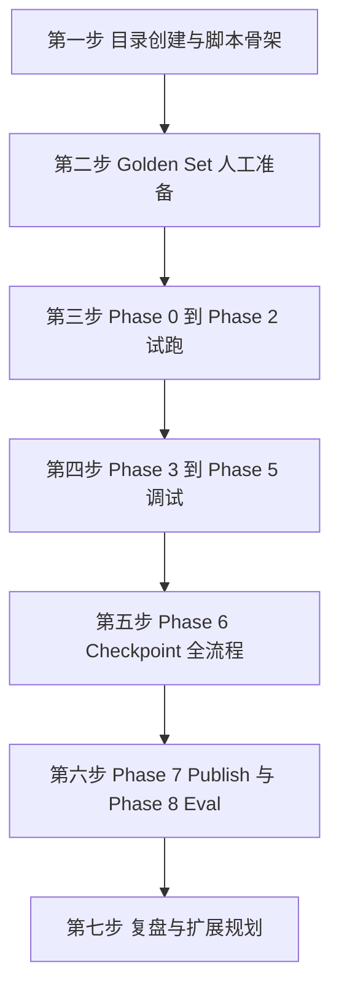
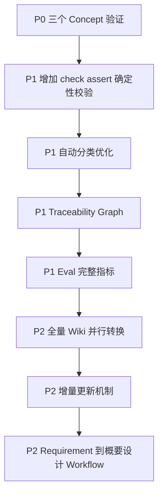

# P0 需求提取流水线 详细执行计划

> 基于 `docs/P0需求分析提取测试.md` 设计方案，结合项目实际现状制定的落地执行计划。
> 创建日期：2026-09-24

---

## 一、执行摘要

本计划将 Wiki 知识转化为可追溯的正式软件需求，通过 7 个 Phase 的 Workflow 流水线实现：



P0 范围：选取 3 个主题，预计产出 20-50 条正式需求，建立 20-50 条 Golden Set 对照评测。

---

## 二、项目现状与关键发现

### 2.1 Wiki 层

| 维度 | 现状 |
|------|------|
| Concepts | 14 个（缺门、换三张、刮风下雨、呼叫转移与擦挂、过手规则、将牌与根、掷骰双分流、流局处理、结算流水线、行牌操作、番型体系、胡牌判定、结算公式、创房配置） |
| Sources | 8 个（基础规则、游戏流程、打牌操作、番型、胡牌类型、结算、配置、UI交互） |
| Syntheses | 2 个（完整流程、自摸涉及的规则番型结算配置UI） |
| Entities | 1 个（功夫川麻） |
| 工具 | health.py、lint.py、build_graph.py、ingest.py 等已就绪 |

### 2.2 Raw 层

`raw/mahjong/` 下有 8 份原始设计文档：

| 编号 | 文件 | 对应 Wiki Source |
|------|------|-----------------|
| 01 | 基础规则.md | sources/基础规则.md |
| 02 | 游戏流程.md | sources/游戏流程.md |
| 03 | 打牌操作.md | sources/打牌操作.md |
| 04 | 番型.md | sources/番型.md |
| 05 | 胡牌类型.md | sources/胡牌类型.md |
| 06 | 结算.md | sources/结算.md |
| 07 | 配置.md | sources/配置.md |
| 08 | UI交互.md | sources/UI交互.md |

### 2.3 关键发现：Concept 名称不匹配

> **这是执行前必须解决的首要问题。**

需求文档中引用的 3 个 P0 topic 文件名在实际 Wiki 中**不存在**，需要做名称映射：

| 需求文档中的名称 | 实际 Wiki 文件 | 映射理由 |
|----------------|---------------|---------|
| `杠与杠分.md` | `刮风下雨.md` + `呼叫转移与擦挂.md` | 刮风下雨涵盖杠类型与杠分计算；呼叫转移涵盖杠分转交机制。两者共同构成"杠与杠分"的完整需求域 |
| `荒庄与查叫.md` | `流局处理.md` | 流局处理 = 荒庄处理，包含退税、查花猪、查大叫三步，完全对应"荒庄与查叫" |
| `自摸相关规则.md` | synthesis `自摸涉及的规则番型结算配置UI.md` | Wiki 中没有独立的"自摸相关规则"concept，但有覆盖规则/番型/结算/配置/UI 五维度的 synthesis 页面 |

**执行决策**：P0 阶段使用以下映射后的 3 个 topic 集合：

1. **杠与杠分** = `刮风下雨.md` + `呼叫转移与擦挂.md`（两个 concept 合并为一个 topic）
2. **荒庄与查叫** = `流局处理.md`
3. **自摸相关规则** = synthesis `自摸涉及的规则番型结算配置UI.md`（关联 concepts：胡牌判定、结算公式、番型体系、行牌操作、创房配置、结算流水线）

### 2.4 Workflow 基础设施

| 能力 | 状态 |
|------|------|
| `.opencode-workflows` 目录 | 不存在，需创建 |
| workflow-authoring skill | 已就绪 |
| workflow-optimize skill | 已就绪 |
| parallel / agent / phase / verify / checkpoint | 可用 |
| check/assert（确定性校验） | P1 计划，P0 用 bash 脚本替代 |

---

## 三、目录结构创建

### 3.1 新增目录

```text
requirements/
├── candidates/          # Phase 1 产出，候选需求按 topic 分文件
│   ├── 杠与杠分.jsonl
│   ├── 荒庄与查叫.jsonl
│   └── 自摸相关规则.jsonl
├── review/              # Phase 2 产出，按证据等级分流
│   ├── explicit.jsonl
│   ├── derived.jsonl
│   ├── conflict.jsonl
│   └── unsupported.jsonl
├── normalized/          # Phase 3 产出，原子化后的需求
│   └── normalized.jsonl
├── deduped/             # Phase 4 产出，去重合并后的需求
│   └── deduped.jsonl
├── gameplay/            # Phase 6 产出，按分类存放最终需求（预留）
├── settlement/
├── config/
├── ui/
├── requirements.jsonl   # Phase 6 最终产出
├── index.md             # Phase 6 需求索引
└── traceability.json    # Phase 6 可追溯图

reports/
└── requirement-extraction-report.md  # Phase 7 评测报告

golden/
└── requirements.jsonl   # 人工准备的标准答案

.opencode-workflows/
└── workflows/
    └── requirement-extraction.js     # Workflow 主脚本

scripts/
├── eval.py              # Phase 7 评测脚本
├── validate_structure.py # Phase 2 确定性校验脚本（P0 替代 check/assert）
└── generate_report.py   # Phase 7 报告生成脚本
```

### 3.2 创建顺序

先创建骨架目录，再填充内容：



---

## 四、执行阶段详解

### Phase 0：Prepare

**目标**：确定本轮输入，生成 workset.json

**输入**：映射后的 3 个 topic 集合

**执行步骤**：

1. 读取 3 个 topic 的 concept/synthesis 页面
2. 解析每个页面的 frontmatter `sources` 字段，找到关联的 raw 源文档
3. 解析页面内的 `[[wikilinks]]`，找到关联的 syntheses
4. 汇总生成 `requirements/workset.json`

**workset.json 结构**：

```json
{
  "created": "2026-09-24",
  "topics": [
    {
      "id": "TOPIC-01",
      "name": "杠与杠分",
      "concepts": [
        "wiki/concepts/刮风下雨.md",
        "wiki/concepts/呼叫转移与擦挂.md"
      ],
      "relatedSyntheses": [
        "wiki/syntheses/自摸涉及的规则番型结算配置UI.md"
      ],
      "rawSources": [
        "raw/mahjong/01-基础规则.md",
        "raw/mahjong/03-打牌操作.md",
        "raw/mahjong/06-结算.md",
        "raw/mahjong/07-配置.md"
      ]
    },
    {
      "id": "TOPIC-02",
      "name": "荒庄与查叫",
      "concepts": [
        "wiki/concepts/流局处理.md"
      ],
      "relatedSyntheses": [
        "wiki/syntheses/自摸涉及的规则番型结算配置UI.md"
      ],
      "rawSources": [
        "raw/mahjong/02-游戏流程.md",
        "raw/mahjong/01-基础规则.md",
        "raw/mahjong/06-结算.md"
      ]
    },
    {
      "id": "TOPIC-03",
      "name": "自摸相关规则",
      "concepts": [
        "wiki/concepts/胡牌判定.md",
        "wiki/concepts/结算公式.md",
        "wiki/concepts/番型体系.md",
        "wiki/concepts/行牌操作.md",
        "wiki/concepts/创房配置.md",
        "wiki/concepts/结算流水线.md"
      ],
      "relatedSyntheses": [
        "wiki/syntheses/自摸涉及的规则番型结算配置UI.md"
      ],
      "rawSources": [
        "raw/mahjong/01-基础规则.md",
        "raw/mahjong/03-打牌操作.md",
        "raw/mahjong/04-番型.md",
        "raw/mahjong/05-胡牌类型.md",
        "raw/mahjong/06-结算.md",
        "raw/mahjong/07-配置.md"
      ]
    }
  ]
}
```

**确定性校验**（bash 脚本）：
- workset.json 中引用的每个文件路径是否存在
- 每个 topic 至少有 1 个 concept 和 1 个 rawSource

---

### Phase 1：Requirement Discovery

**目标**：并行发现候选需求，每个 topic 独立 agent

**核心原则**：

> 找需求，不判断最终正确与否。不做代码设计，不补充 Wiki 中不存在的规则。

**并行策略**：



**每个 Agent 的 prompt 要点**：

1. 阅读指定 concept(s) 和关联 synthesis
2. 找出所有候选需求，每条需求必须原子化（一条一个行为）
3. 不做代码设计，不补充 Wiki 中不存在的规则
4. 保存 source references（wiki 页面路径 + 原始文档路径）
5. 输出 JSONL 格式

**Candidate Schema**（P0 极简版）：

```json
{
  "temp_id": "CAND-001",
  "topic": "杠与杠分",
  "category": "settlement",
  "title": "杠牌后计算杠分",
  "requirement": "玩家完成符合条件的杠牌后需要计算杠分",
  "wiki_sources": ["wiki/concepts/刮风下雨.md"],
  "raw_source_hints": ["raw/mahjong/06-结算.md"]
}
```

**编号规则**：使用 `CAND-xxx`（不使用 `REQ-xxx`，因为尚未通过验证）

**确定性校验**（bash 脚本）：
- 每个 candidates/*.jsonl 文件非空
- 每行是合法 JSON
- 每条记录包含 temp_id、requirement、wiki_sources 字段

---

### Phase 2：Evidence Validation

**目标**：每个候选需求回 raw 原始文档查证据，判定证据等级

> **这是整个 Workflow 最重要的一层。** 防止 Wiki 幻觉。

**证据等级定义**：

| 等级 | 含义 | 处理方式 |
|------|------|---------|
| `explicit` | raw 原文直接、明确描述了该需求 | 通过，进入 Normalize |
| `derived` | raw 原文未直接描述，但可从现有规则合理推导 | 标注，进入 Normalize，需人工重点审核 |
| `unsupported` | raw 原文无任何支持，疑似 Wiki 幻觉 | 移入 review/unsupported.jsonl |
| `conflict` | raw 原文与 Wiki 描述存在矛盾 | 移入 review/conflict.jsonl，需人工裁定 |

**并行策略**：每个 candidate 独立 agent 查证据

**Validation 结果 Schema**：

```json
{
  "temp_id": "CAND-001",
  "evidence_level": "explicit",
  "raw_sources": ["raw/mahjong/06-结算.md#杠分"],
  "evidence_summary": "raw 06-结算.md 第六章明确描述了杠分计算规则：直杠2倍、补杠1倍、暗杠2倍",
  "confidence": 0.96
}
```

**关键约束**：

> 禁止仅凭 Wiki 判定需求成立。必须回到 raw 原始需求文档查找依据。

---

### Phase 3：verify 语义校验

**目标**：对 `explicit` 和 `derived` 等级的候选需求进行语义级验证

**职责边界**：

| 工具 | 职责 | 示例 |
|------|------|------|
| `agent` | 做工作 | 发现需求、查证据、原子化 |
| bash 脚本（P0）/ check（P1） | 确定性校验 | 文件存在、JSON 合法、字段完整 |
| `verify` | LLM 语义校验 | 需求描述是否被 raw 原文支持 |
| `checkpoint` | 人工判断 | Approve / Reject / Edit |

**verify 使用场景**：

```javascript
const result = await verify({
  requirement: candidate.requirement,
  evidence: rawEvidence,
  criteria: "Requirement 必须能够从原始文档得到直接支持，不允许增加新的游戏规则。"
})
```

**verify 不用于**：文件存在性检查、JSON 格式校验、路径正确性（这些用 bash 脚本）

---

### Phase 4：Atomicity Normalize

**目标**：验证通过的候选需求做原子化拆分 + 统一表达 + 统一分类

**原子化规则**：

如果发现类似：
> "玩家胡牌以后计算番型并进行结算然后显示结算界面"

应拆为 3 条：
1. 计算胡牌番型
2. 根据番型计算结算结果
3. 结算完成后展示结算界面

**Normalize Agent 职责限制**：

| 允许 | 禁止 |
|------|------|
| 拆分（一条多行为拆成多条） | 新增业务含义 |
| 标准化（统一表述格式） | 删除原始约束 |
| 分类（gameplay / settlement / config / ui） | 修改游戏规则 |

**分类标准**：

| category | 覆盖范围 |
|----------|---------|
| `gameplay` | 行牌操作、胡牌判定、过手规则、流局处理等核心游戏逻辑 |
| `settlement` | 结算公式、杠分计算、番型倍数、封顶截断等算分类 |
| `config` | 创房配置项、规则开关、番型开关等配置类 |
| `ui` | 操作按钮、动画特效、结算文案、界面交互等 |

---

### Phase 5：Semantic Dedup

**目标**：跨 topic 合并语义重复的需求，保留所有来源

**为什么必须**：

因为 3 个 topic 可能同时提取出"杠分结算"：
- 杠与杠分 topic 提取了杠分计算需求
- 自摸相关规则 topic 提取了杠上花的杠分需求
- 两者的核心需求可能重叠

**合并流程**：



**合并后 Schema**：

```json
{
  "id": "REQ-SETTLEMENT-001",
  "title": "杠牌后计算杠分",
  "category": "settlement",
  "requirement": "玩家完成符合条件的杠牌后需要进行杠分计算",
  "evidence_level": "explicit",
  "sources": {
    "wiki": [
      "wiki/concepts/刮风下雨.md",
      "wiki/syntheses/自摸涉及的规则番型结算配置UI.md"
    ],
    "raw": [
      "raw/mahjong/06-结算.md",
      "raw/mahjong/03-打牌操作.md"
    ]
  }
}
```

> **合并 Requirement，保留所有 Traceability。不删除来源。**

---

### Phase 6：Checkpoint 人工审核

**目标**：Workflow 暂停，人工审核全部结果

**Checkpoint 展示内容**：

```text
需求提取结果摘要
========================================
发现需求: 36 条
  explicit:  27 条
  derived:    5 条
  conflict:   2 条
  unsupported: 2 条

去重合并: 36 → 31 条
========================================
```

**人工操作**：

| 操作 | 说明 |
|------|------|
| Approve | 批准需求进入正式库 |
| Reject | 拒绝该需求 |
| Edit | 修改需求描述/分类后再批准 |

**只有 Approved 的需求才进入 Phase 7。**

---

### Phase 7：Publish

**目标**：批准后统一分配永久 ID，生成最终产物

**ID 分配规则**：

```text
REQ-GAME-001          gameplay 类
REQ-GAME-002

REQ-SETTLEMENT-001    settlement 类
REQ-SETTLEMENT-002

REQ-UI-001            ui 类

REQ-CONFIG-001        config 类
```

> 不提前生成永久 ID，只在 Publish 阶段统一分配。

**生成 3 个文件**：

| 文件 | 内容 |
|------|------|
| `requirements/requirements.jsonl` | 所有正式需求（每行一条 JSON） |
| `requirements/index.md` | 需求索引（按分类列出，附一行摘要） |
| `requirements/traceability.json` | 可追溯图（每个 REQ → wiki sources → raw sources） |

**index.md 格式**：

```markdown
# Requirements Index

## Gameplay
- [REQ-GAME-001] 胡牌判定两层校验 — 番型合法性 + 胡牌类型合法性
- ...

## Settlement
- [REQ-SETTLEMENT-001] 杠牌后计算杠分 — 直杠2倍/补杠1倍/暗杠2倍
- ...

## Config
- [REQ-CONFIG-001] 自摸模式三选一 — 加倍/加底/不加

## UI
- [REQ-UI-001] 自摸按钮显示 — 可自摸时显示自摸+过按钮
```

**traceability.json 格式**：

```json
{
  "REQ-SETTLEMENT-001": {
    "wiki": ["wiki/concepts/刮风下雨.md"],
    "raw": ["raw/mahjong/06-结算.md"]
  }
}
```

---

### Phase 8：Eval

**目标**：对 Golden Set 评测，验证 LLM-Wiki 是否提升需求抽取质量

**Golden Set 准备**：

人工从 3 个 topic 的 raw 原始文档中整理 20-50 条标准需求，存入 `golden/requirements.jsonl`。

**P0 关注的 4 个核心指标**：

| 指标 | 含义 | 计算方式 |
|------|------|---------|
| Recall | 已知需求找出来多少 | 命中 Golden 条数 / Golden 总条数 |
| Precision | 生成的需求有多少是真的 | 命中 Golden 条数 / 生成总条数 |
| Unsupported Rate | 幻觉需求比例 | unsupported 条数 / 候选总条数 |
| Traceability | 是否能回溯到 Raw | 有 raw 证据的需求条数 / 正式需求总条数 |

**评测脚本** `scripts/eval.py`：

1. 加载 `requirements/requirements.jsonl`（实际产出）
2. 加载 `golden/requirements.jsonl`（标准答案）
3. 语义匹配（LLM 辅助判断两条需求是否等价）
4. 计算 4 个指标
5. 输出 `reports/requirement-extraction-report.md`

---

## 五、Workflow 脚本架构设计

### 5.1 脚本文件

`requirements/.opencode-workflows/workflows/requirement-extraction.js`

### 5.2 脚本结构（伪代码）

```javascript
export const meta = {
  name: 'requirement_extraction',
  description: 'P0 需求提取流水线：Wiki -> 候选 -> 验证 -> 原子化 -> 去重 -> 审核 -> 发布 -> 评测'
}

// ===== Phase 0 Prepare =====
phase("Phase 0 Prepare")
const workset = await agent("读取 workset.json，确认 3 个 topic 的 concept 和 raw 路径", {
  agentType: 'general'
})

// 确定性校验：文件路径存在性
// P0 用 bash 脚本替代 check/assert

// ===== Phase 1 Discovery =====
phase("Phase 1 Requirement Discovery")
const candidates = await parallel(
  workset.topics.map(topic =>
    agent(buildDiscoveryPrompt(topic), { agentType: 'general' })
  )
)
// 输出: requirements/candidates/*.jsonl

// ===== Phase 2 Evidence Validation =====
phase("Phase 2 Evidence Validation")
const allCandidates = loadAllCandidates()
const validated = await parallel(
  allCandidates.map(cand =>
    agent(buildValidationPrompt(cand), { agentType: 'general' })
  )
)
// 分流到 review/explicit.jsonl, review/derived.jsonl, review/conflict.jsonl, review/unsupported.jsonl

// ===== Phase 3 verify =====
phase("Phase 3 Semantic Verify")
const toVerify = validated.filter(v => v.evidence_level === 'explicit' || v.evidence_level === 'derived')
const verified = await parallel(
  toVerify.map(cand =>
    verify({
      requirement: cand.requirement,
      evidence: cand.rawEvidence,
      criteria: "Requirement 必须能够从原始文档得到直接支持，不允许增加新的游戏规则。"
    })
  )
)

// ===== Phase 4 Normalize =====
phase("Phase 4 Atomic Normalize")
const normalized = await agent(buildNormalizePrompt(verified), { agentType: 'general' })

// ===== Phase 5 Dedup =====
phase("Phase 5 Semantic Dedup")
const deduped = await agent(buildDedupPrompt(normalized), { agentType: 'general' })

// ===== Phase 6 Checkpoint =====
phase("Phase 6 Checkpoint")
await checkpoint("请审核 Requirement Extraction Result", deduped)

// ===== Phase 7 Publish =====
phase("Phase 7 Publish")
const published = await agent(buildPublishPrompt(deduped), { agentType: 'general' })

// ===== Phase 8 Eval =====
phase("Phase 8 Eval")
await agent(buildEvalPrompt(published), { agentType: 'general' })
```

### 5.3 失败处理：状态驱动而非嵌套 if

```javascript
phase("Discovery")
const discovery = await runDiscovery()

// 确定性校验
if (!discovery.outputExists) {
  jump("Report")  // 跳到报告阶段
}

phase("Validation")
const validation = await validateEvidence(discovery)

if (validation.hasBlockingError) {
  jump("Report")
}

phase("Normalize")
const normalized = await normalize(validation)

phase("Dedup")
const requirements = await dedup(normalized)

phase("Review")
await checkpoint(requirements)

phase("Publish")
await publish(requirements)

phase("Eval")
await evaluate(requirements)

phase("Report")
await generateReport()
```

---

## 六、Golden Set 准备

### 6.1 准备方式

人工阅读 3 个 topic 对应的 raw 原始文档，独立整理标准需求。

### 6.2 Golden Set 分配

| Topic | raw 来源 | 预计 Golden 条数 |
|-------|---------|-----------------|
| 杠与杠分 | 01-基础规则、03-打牌操作、06-结算、07-配置 | 8-15 条 |
| 荒庄与查叫 | 02-游戏流程、01-基础规则、06-结算 | 6-12 条 |
| 自摸相关规则 | 01-基础规则、03-打牌操作、04-番型、05-胡牌类型、06-结算、07-配置 | 10-20 条 |
| **合计** | | **24-47 条** |

### 6.3 Golden Schema

```json
{
  "id": "GOLDEN-001",
  "topic": "杠与杠分",
  "category": "settlement",
  "title": "杠牌后计算杠分",
  "requirement": "玩家完成符合条件的杠牌后需要进行杠分计算",
  "raw_source": "raw/mahjong/06-结算.md"
}
```

---

## 七、风险与缓解

| 风险 | 影响 | 缓解措施 |
|------|------|---------|
| Concept 名称不匹配导致 agent 读取失败 | 流水线中断 | Phase 0 已做名称映射，workset.json 中使用实际文件路径 |
| 自摸相关规则涉及 6 个 concept，上下文过大 | 大上下文 + 大 JSON 问题 | 将 6 个 concept 的关键摘要先提取，只传摘要给 agent |
| 跨 topic 去重时语义判断不准 | 重复或误合并 | Phase 5 后增加确定性校验：检查合并后条数是否合理 |
| Golden Set 人工准备耗时 | 阻塞 Eval | 可先跑 Phase 1-6，Golden Set 与 Pipeline 并行准备 |
| Wiki 中已有的幻觉内容传入候选 | unsupported 偏高 | Phase 2 强制回 raw 查证据，这是设计核心防线 |
| checkpoint 审核工作量 | 人工瓶颈 | P0 控制在 30 条左右规模，单次审核 15-30 分钟可完成 |

---

## 八、时间安排

### 8.1 分步执行计划



### 8.2 各步预计工作量

| 步骤 | 内容 | 预计时间 |
|------|------|---------|
| 第一步 | 创建目录结构 + 编写 workflow 脚本骨架 + 辅助脚本 | 1-2 小时 |
| 第二步 | 人工阅读 raw 整理 20-50 条 Golden Set | 2-3 小时 |
| 第三步 | Phase 0-2 试跑，验证候选产出和证据分流 | 1 小时 |
| 第四步 | Phase 3-5 调试，验证原子化和去重效果 | 1-2 小时 |
| 第五步 | Phase 6 全流程跑通到 Checkpoint | 30 分钟 |
| 第六步 | Phase 7-8 发布与评测，生成报告 | 1 小时 |
| 第七步 | 复盘，调整扩展到全部 concepts 的计划 | 1 小时 |
| **合计** | | **7-10 小时** |

---

## 九、扩展路径

P0 验证通过后的扩展路径：



---

## 十、类比理解

### 工厂质检流水线

把这条 Requirement Extraction Pipeline 类比为一个**从矿石到精钢的冶金流水线**：

| Pipeline 阶段 | 冶金类比 | 说明 |
|--------------|---------|------|
| Phase 0 Prepare | 勘探矿区、确定开采面 | 选定要处理的 wiki concept 和 raw 矿脉 |
| Phase 1 Discovery | 粗筛矿石 | 并行开采，把看起来有用的"矿石"（候选需求）都挖出来 |
| Phase 2 Validation | 化验成分 | 每块矿石回实验室（raw 原文）检测成分，分出纯矿/合金/废渣/杂质 |
| Phase 3 verify | 质检员复检 | 对通过化验的矿石做语义级复检，确认不是假货 |
| Phase 4 Normalize | 切割标准件 | 把大矿石切成标准尺寸（原子化），统一规格（标准化） |
| Phase 5 Dedup | 合并同批号 | 相同成分的矿石合并批次，保留所有产地记录（来源不丢） |
| Phase 6 Checkpoint | 出厂前终检 | 质检总监（人工）逐批签字放行 |
| Phase 7 Publish | 打钢印出厂 | 给每块精钢打上永久编号（REQ-xxx），附产地证书（traceability） |
| Phase 8 Eval | 年度质量审计 | 对标行业标准（Golden Set），算合格率和召回率 |

### 为什么不能跳过 Phase 2

Wiki 是"传闻证据"——经过了 LLM 的二次加工和提炼。就像**法庭不能仅凭传闻定罪**，必须回到原始证据（raw 原文）核实。跳过 Phase 2 等于用未经交叉质证的证词直接判案，Wiki 中的任何幻觉都会变成虚假需求进入代码实现。

---

## 十一、引用说明

| 序号 | 引用来源 | 说明 |
|------|---------|------|
| 1 | `docs/P0需求分析提取测试.md` | 本执行计划的需求设计来源，包含 7 Phase 架构和 Schema 定义 |
| 2 | `AGENTS.md` | LLM Wiki Agent 的 Schema 与 Workflow 规范，定义了 Ingest/Query/Health/Lint/Graph 工作流 |
| 3 | `wiki/index.md` | Wiki 索引，确认 14 个 concept、8 个 source、2 个 synthesis 的实际文件名 |
| 4 | `wiki/concepts/刮风下雨.md` | 杠牌统称体系（刮风=明杠，下雨=暗杠），杠与杠分 topic 的核心 concept |
| 5 | `wiki/concepts/呼叫转移与擦挂.md` | 杠分转交机制，杠与杠分 topic 的补充 concept |
| 6 | `wiki/concepts/流局处理.md` | 流局三步处理（退税/查花猪/查大叫），荒庄与查叫 topic 的 concept |
| 7 | `wiki/syntheses/自摸涉及的规则番型结算配置UI.md` | 自摸五维度分析，自摸相关规则 topic 的 synthesis 来源 |
| 8 | `docs/需求拆解llm-wiki讨论.md` | 需求拆解的早期讨论文档 |
| 9 | `tools/health.py` | Wiki 结构完整性检查工具，Pipeline 可复用其确定性校验思路 |
| 10 | OpenCode Dynamic Workflows 文档 | parallel / agent / phase / verify / checkpoint API 参考 |
