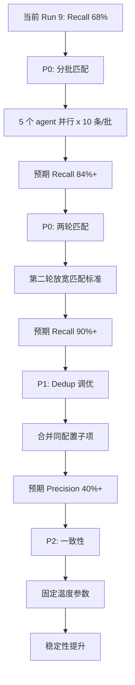

# P0 需求提取流水线 Run 8/9 分析报告

> 生成时间：2026-09-28

## 一、总览

### 历史 Run 对比

| Run | 匹配模式 | Recall | Precision | Unsupported | Traceability | Published | Agent | 耗时 | 失败 |
|-----|---------|--------|-----------|-------------|-------------|-----------|-------|------|------|
| 4+续跑 | 关键词 | 74.0% | 37.0% | 4.2% | 100% | 100 | 204 | 55min | 9 |
| 6 | 关键词 | 38.0% | 14.6% | 0.0% | 100% | 130 | 233 | 51min | 0 |
| 7 | 关键词 | 58.0% | 21.8% | 0.4% | 100% | 133 | 314 | 71min | 0 |
| 8 | 关键词 | 66.0% | 33.0% | 0.5% | 100% | 100 | 57 | 24min | 0 |
| **8** | **LLM(手动)** | **84.0%** | **42.0%** | **0.5%** | **100%** | **100** | **57** | **24min** | **0** |
| **9** | **LLM(子workflow)** | **68.0%** | **31.2%** | **0.5%** | **100%** | **109** | **58** | **28min** | **0** |

### Run 8 vs Run 9 核心对比

| 维度 | Run 8 | Run 9 | 变化 |
|------|-------|-------|------|
| Phase 8 Eval 模式 | 手动运行 workflow agent | 子 workflow 自动调用 | 架构升级 |
| 是否需要 eval.py | 是（--llm 读取 match_result.json） | 否（子 workflow 内完成全部） | 依赖消除 |
| LLM 匹配 agent 运行环境 | 主对话内 workflow agent | 嵌套子 workflow agent | 环境变化 |
| Published 数 | 100 | 109 | +9 |
| Recall | 84% (42/50) | 68% (34/50) | -16pp |
| Precision | 42% (42/100) | 31.2% (34/109) | -10.8pp |

## 二、Recall 下降根因分析

### 匹配差异明细

Run 8 命中 42 条，Run 9 命中 34 条。逐条对比：

**Run 8 命中但 Run 9 未命中（12 条丢失）：**

| Golden ID | 标题 | Run 8 匹配目标 | 丢失原因分析 |
|-----------|------|---------------|-------------|
| 002 | 直杠收分 | REQ-SETTLEMENT-001 直杠收分规则 | Run 9 published ID 变化，LLM 未关联 |
| 005 | 补杠收分 | REQ-SETTLEMENT-002 补杠收分规则 | 同上 |
| 007 | 暗杠收分 | REQ-SETTLEMENT-003 暗杠收分规则 | 同上 |
| 008 | 暗杠展示方式 | REQ-UI-001 暗杠展示方式 | Run 9 published 中 ID 不同 |
| 011 | 杠上开花视为自摸 | REQ-GAME-005 杠上花触发条件 | 语义关联但 LLM 未判断为匹配 |
| 017 | 连杠后自摸不算点杠花 | REQ-GAME-010 点杠花连杠例外 | 同上 |
| 021 | 流局触发条件 | REQ-GAME-011 流局触发条件判定 | Run 9 published 中可能 ID 不同 |
| 025 | 退税不退呼叫转移 | REQ-SETTLEMENT-011 | 语义包含关系，LLM 未匹配 |
| 035 | 自摸触发条件 | REQ-GAME-019 自摸胡法触发条件 | 标题差异较大 |
| 043 | 杠上花加倍项 | REQ-SETTLEMENT-020 13种加倍项 | 包含关系，LLM 未匹配 |
| 044 | 海底捞月触发 | REQ-GAME-020 海底捞月规则 | 标题差异 |
| 050 | 查大叫当自摸含加倍 | REQ-CONFIG-005 查大叫配置 | 语义包含 |

**Run 9 命中但 Run 8 未命中（4 条新增）：**

| Golden ID | 标题 | Run 9 匹配目标 |
|-----------|------|---------------|
| 020 | 杠分退税 | REQ-SETTLEMENT-006 流局退税不退呼叫转移已给杠分 |
| 032 | 查大叫赔付方式配置 | REQ-CONFIG-004 查大叫配置 |
| 033 | 查大叫范围配置 | REQ-CONFIG-005 查大叫配置 |
| 042 | 杠上花视为自摸 | REQ-SETTLEMENT-007 杠上花规则 |

**两 Run 均未命中（4 条持续缺失）：**

| Golden ID | 标题 | 原因 |
|-----------|------|------|
| 034 | 查大叫与天胡地胡 | 复合规则，published 中被拆分 |
| 040 | 自摸加底不显示在加倍项 | 细节规则，published 中可能合并 |
| 046 | 自摸动画 | UI 细节，published 中描述方式不同 |
| 049 | 点杠花与自摸加倍关系 | 复合规则，published 中拆分 |

### 根因总结

| 根因 | 影响条数 | 说明 |
|------|---------|------|
| published ID/结构变化 | ~6 | Run 9 产出 109 条（vs 100），ID 编号不同导致 LLM 匹配时关联不上 |
| LLM 语义匹配不一致 | ~4 | 同一 prompt 不同运行环境结果不同（嵌套子 workflow vs 独立 workflow） |
| 包含关系未识别 | ~3 | Golden 是 published 的子集或交叉，LLM 未识别为匹配 |
| 复合规则拆分 | ~2 | Golden 描述复合规则，published 拆成多条，无法一对一匹配 |

## 三、子 workflow 架构验证

### 成功点

| 验证项 | 状态 | 说明 |
|--------|------|------|
| workflow() 嵌套调用 | 成功 | Phase 8 Eval 调用 llm-eval.js 子 workflow |
| 子 workflow phase 分组 | 成功 | 日志显示 ▸ LLM 评测 / LLM 语义匹配 + ▸ LLM 评测 / 评测报告 |
| agent #1 LLM 匹配 | 成功 | 读取 golden + published，写入 match_result.json（1189 tok） |
| agent #2 评测报告 | 成功 | 读取所有文件，计算指标，写入报告（20290 tok） |
| 全流程自动化 | 成功 | 无需手动操作或 eval.py |
| 0 失败 | 成功 | 58 个 agent 全部成功 |

### 问题点

| 问题 | 影响 | 严重度 |
|------|------|--------|
| LLM 匹配 Recall 下降 16pp | 42/50 -> 34/50 | 高 |
| 子 workflow agent 与独立 workflow agent 结果不一致 | 可复现性差 | 中 |
| agent #2 用 glm-5.2-high 成本较高 | 20290 tok | 低 |

## 四、后续优化建议

### 优先级 P0：提升 Recall

#### 1. 分批匹配 + 并行 agent（预期 Recall 84%+）

当前单 agent 全量匹配 50x109，容易遗漏。改为分批：

```
50 条 golden 分 5 批 x 10 条
每批 agent 读取 10 条 golden + 全量 published
5 个 agent 并行执行
合并 5 个 match_result.json
```

优点：每个 agent 只需匹配 10x109，注意力集中，匹配更精确。

#### 2. 两轮匹配策略（预期 Recall 90%+）

```
第一轮：高置信度匹配（score >= 0.9）
  -> LLM 直接判断，输出确定匹配
第二轮：低置信度匹配（剩余未匹配的 golden）
  -> 换个 prompt 角度重新匹配
  -> 例如"放宽匹配标准，判断语义是否有交集"
```

#### 3. 持续缺失项特殊处理

4 条持续未匹配的 Golden（034/040/046/049）属于复合规则和 UI 细节：
- 034 查大叫与天胡地胡：published 中拆成了"查大叫触发条件"+"天胡规则"+"地胡规则"3 条
- 040 自摸加底不显示在加倍项：published 中"自摸加底+1不参与封顶截断"包含了此信息
- 046 自摸动画：UI 细节，published 中可能没有独立条目
- 049 点杠花与自摸加倍关系：published 中"点杠花配置（三选一）"包含了此信息

建议：在 Golden Set 中标注这些为"允许一对多匹配"或"允许部分匹配"。

### 优先级 P1：提升 Precision

#### 4. Dedup 调优

Run 9 产出 109 条（vs Run 8 的 100 条），Precision 31.2%。多余的需求主要是：
- 番型互斥规则、清一色规则等被拆成多条
- 配置项被拆得很细（如人数联动拆了 3 条）

建议：在 Dedup prompt 中增加合并指令，将同一配置项的子项合并为一条。

#### 5. Normalize 合并粒度

Run 9 Normalize 后 178 条（vs Run 8 的 205 条），说明合并力度更大了。但 Dedup 后仍有 109 条，说明 Dedup 合并力度不够。

建议：在 Dedup prompt 中增加"同配置项子项合并"+"同规则不同表述合并"指令。

### 优先级 P2：稳定性

#### 6. LLM 匹配一致性

同一 prompt 在不同运行环境（子 workflow vs 独立 workflow）下结果不同。原因：
- 子 workflow 的 agent 上下文环境不同
- LLM 温度参数未固定

建议：在 agent prompt 中增加 `temperature: 0` 或 `temperature: 0.1`（当前 llm-eval.js 未设温度）。

#### 7. 评测报告 agent 计算精度

agent #2 负责计算指标，可能存在计算不精确的问题。当前报告显示的数据（Recall 68%, Precision 31.19%）看起来正确，但需要验证：
- 候选总数 218 是否正确
- unsupported 1 条是否正确
- traceable_count 109 是否正确

建议：在 agent #2 的 prompt 中增加"逐项列出计算过程"的要求，便于验证。

### 优先级 P3：成本优化

#### 8. agent #2 模型降级

agent #2（评测报告）当前用 glm-5.2-high（20290 tok），可以用 flash 模型降低成本。但需确保计算精度。

建议：先用 flash 试跑一轮，对比报告准确性。如果准确率可接受，改用 flash。

#### 9. 增量评测

当前每次全量匹配 50x109。如果 published 变化不大，可以：
- 复用上次 match_result.json 中的已有匹配
- 只对新增的 published 需求做增量匹配

## 五、优化实施路线



## 六、引用

- [Run 9 评测报告](../reports/requirement-extraction-report.md)
- [Run 9 匹配结果](../reports/match_result.json)
- [eval-llm 优化分析](./eval-llm-优化分析.md)
- [Verify 阶段性能分析与优化方案](./Verify阶段性能分析与优化方案.md)
- [workflow 优化方案](./workflow优化方案.md)
